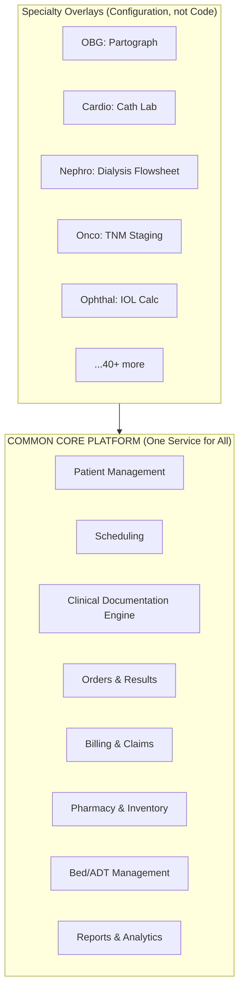

# Common Services & Workflows — Unified Core Platform
## One Service Layer for All Specialties, Hospitals & Clinics

**Document Version:** 1.0
**Last Updated:** June 10, 2026
**Purpose:** Define the specialty-agnostic core services and workflows that form the single shared platform. Every specialty module (Tier 1-4) is built ON TOP of this layer — never duplicated inside it.

**Related Document:** [specialty-priority-list.md](specialty-priority-list.md)

---

## 🏗️ Design Principle: Core + Specialty Overlay



**Rule:** A specialty never gets its own registration, scheduling, billing, or ordering system. It only gets:
1. **Templates** (specialty note formats, assessment forms)
2. **Order sets** (specialty-specific test/procedure bundles)
3. **Flowsheets** (specialty vitals/parameters)
4. **Care pathways** (specialty protocols)

This makes the same product deployable to a 500-bed multi-specialty hospital, a single-doctor clinic, or a dialysis chain — by switching ON/OFF modules and loading specialty configuration packs.

---

## 1️⃣ PATIENT MANAGEMENT (Common to ALL)

### 1.1 Patient Registration & Identity
| Service | Description | Used By |
|---------|-------------|---------|
| New patient registration | Demographics, contact, photo, ID proof | All |
| ABHA/Health ID linking | ABDM-compliant health ID creation & verification | All |
| UHID generation | Unique hospital ID, MRN management | All |
| Duplicate detection & merge | Phonetic + demographic matching | All |
| Family linking | Link family members (critical for Pediatrics, OBG) | All |
| Insurance/payer registration | TPA, Ayushman Bharat, CGHS, ESI, corporate | All |
| Consent management | Digital consent capture, specialty consent templates | All |

### 1.2 Patient 360° View (Single Longitudinal Record)
- Master problem list (shared across ALL specialties)
- Allergy & adverse reaction registry (one source of truth)
- Medication list (active/past, reconciled across departments)
- Vitals history (all encounters, all departments)
- Visit timeline (OPD, IPD, ER, daycare — unified)
- Documents & reports repository
- Immunization record

> **Why common:** A diabetic patient seen by Endocrinology, Cardiology, Nephrology and Ophthalmology must have ONE record. Chronic-disease longitudinal care is the core value proposition.

---

## 2️⃣ APPOINTMENT & SCHEDULING (Common to ALL)

### 2.1 Common Scheduling Engine — 4 Universal Modes
| Mode | Description | Specialty Examples |
|------|-------------|-------------------|
| **Time-slot OPD** | Doctor calendar, token/queue | GenMed, Pedia, Derm, ENT — all OPD |
| **Resource/Slot daycare** | Chair/machine/bay scheduling | Dialysis, Chemo, Endoscopy, Cataract |
| **OT scheduling** | Theatre, surgeon, anesthetist, equipment | All surgical specialties |
| **Diagnostic scheduling** | Modality worklist (CT, MRI, USG, Echo) | Radiology, Cardiology, OBG scans |

### 2.2 Common Workflow
```
Book → Confirm (SMS/WhatsApp) → Reschedule/Cancel → Check-in →
Queue/Token display → Consultation → Checkout → Follow-up booking
```

- Walk-in + advance booking + online (patient app/portal)
- Multi-channel reminders (SMS, WhatsApp, IVR)
- Doctor leave/roster management
- Wait-time & queue dashboards
- Referral appointments (cross-specialty, internal & external)

---

## 3️⃣ CLINICAL DOCUMENTATION ENGINE (Common to ALL)

### 3.1 One Template Engine, Many Specialty Templates
The platform ships **one structured documentation engine**; each specialty is a template pack:

| Common Component | How Specialties Customize |
|------------------|---------------------------|
| SOAP/encounter note framework | Specialty sections (e.g., obstetric history, joint exam) |
| Structured forms builder | Drag-drop assessment forms (PHQ-9, APGAR, GCS) |
| Smart text/macros | Specialty phrase libraries |
| Voice-to-text dictation | Specialty vocabularies |
| Drawing/annotation on body diagrams | Specialty diagrams (dental chart, eye diagram, skin map) |
| Photo/document capture | Wound photos, derm photos, scan uploads |
| Flowsheet engine | Specialty parameter sets (ICU hourly, dialysis, partograph) |
| Scoring calculator engine | Any score = formula + fields (APACHE, MELD, TIMI, Kt/V) |

### 3.2 Universal Clinical Workflows
| Workflow | Common Steps (identical everywhere) |
|----------|--------------------------------------|
| **OPD Consult** | Check-in → Nurse vitals → Doctor note → Diagnosis (ICD-10) → Orders → e-Rx → Follow-up → Checkout |
| **IPD Admission** | Admission request → Bed assign → Initial assessment → Daily progress notes → Orders → Discharge summary |
| **Pre-op → OT → Post-op** | Pre-anesthetic check → Consent → WHO surgical safety checklist → OT notes → Recovery → Post-op orders |
| **Daycare** | Slot check-in → Pre-procedure vitals → Procedure record → Post-procedure observation → Same-day discharge |
| **Emergency** | Triage → Rapid assessment → Stabilization orders → Disposition (admit/discharge/transfer/refer) |
| **Discharge** | Discharge order → Med reconciliation → Summary generation → Billing clearance → Follow-up appointment |

### 3.3 Universal Coding & Terminology
- ICD-10 diagnosis coding (all specialties)
- SNOMED CT clinical terms
- LOINC for lab
- Procedure master (mapped to billing tariffs)

---

## 4️⃣ ORDERS & RESULTS (Common to ALL — CPOE)

### 4.1 One Ordering System
| Order Type | Common Behavior | Specialty Customization |
|-----------|------------------|-------------------------|
| Lab orders | Order → Sample collect → LIS → Result → Acknowledge | Specialty order sets (e.g., "Diabetic panel") |
| Radiology orders | Order → Schedule → PACS/RIS → Report → Acknowledge | Specialty protocols (e.g., obstetric scan series) |
| Medication orders | e-Rx → interaction/allergy check → Pharmacy | Specialty favorites & protocols (chemo regimens) |
| Procedure orders | Order → Schedule → Document → Bill | Specialty procedure catalogs |
| Nursing orders | Order → Task list → Execution chart | Specialty care plans |
| Diet orders | Order → Kitchen/dietetics | Specialty diets (renal, diabetic, post-op) |
| Blood orders | Request → Cross-match → Issue → Transfusion record | — |
| Referral orders | Refer → Accept → Consult note back | All specialties (this is the glue between them) |

### 4.2 Universal Result Management
- Unified inbox: all results to ordering doctor
- Critical value alerts (configurable thresholds)
- Cumulative result trends/graphs
- Result acknowledgment audit trail

---

## 5️⃣ BILLING, PACKAGES & CLAIMS (Common to ALL)

### 5.1 One Billing Engine
| Service | Description |
|---------|-------------|
| Tariff master | Multi-payer price lists (cash, TPA, Ayushman, CGHS, ESI, corporate) |
| OPD billing | Consult + services + pharmacy at checkout |
| IPD interim & final billing | Auto-capture from orders, bed charges, OT charges |
| Package billing | Maternity, surgery, health checkup, dialysis-monthly, chemo-cycle packages |
| Daycare billing | Slot-based procedure billing |
| Advance/deposit management | IPD deposits, refunds |
| Discounts & approvals | Role-based discount workflows |
| Insurance pre-auth → claim → settlement | TPA/Ayushman/CGHS claim lifecycle with document attachment |
| GST-compliant invoicing & receipts | All payment modes (cash, card, UPI) |

> **Why common:** Package + daycare + claim workflows are identical mechanics across specialties — only the package contents differ (cataract package vs. dialysis package vs. maternity package).

---

## 6️⃣ PHARMACY & INVENTORY (Common to ALL)

- Drug master with generics, brands, schedules (H/H1/X)
- e-Prescription → pharmacy queue → dispense → bill
- Drug-drug interaction & allergy checking (one engine, all specialties)
- Ward indents & floor stock
- Purchase → GRN → stock → expiry management
- Consumables & implant inventory (ortho implants, IOLs, stents, catheters — same inventory engine, different catalogs)
- Narcotic register & audit

---

## 7️⃣ BED MANAGEMENT / ADT (Common to ALL inpatient)

- Bed board (real-time occupancy, housekeeping status)
- Admission → Transfer → Discharge (ADT) workflow
- Ward/room/bed class hierarchy (affects billing automatically)
- ICU ↔ ward transfers with handoff notes
- Estimated discharge date & discharge lounge tracking

---

## 8️⃣ NURSING WORKFLOWS (Common to ALL)

| Workflow | Description |
|----------|-------------|
| Vitals charting | Same engine — specialty defines frequency & parameters |
| Medication administration (eMAR) | Scan/verify → administer → chart (all wards) |
| Intake/output charting | Universal fluid balance |
| Nursing assessment & care plans | Template-driven per specialty |
| Shift handover (SBAR) | Universal format |
| Task lists | Auto-generated from orders |
| Fall risk / pressure ulcer / pain scores | Universal scoring engine |

---

## 9️⃣ SHARED OPERATIONAL SERVICES

| Service | Common to |
|---------|-----------|
| **Queue & token management** | All OPD, lab, pharmacy, billing counters |
| **MRD (Medical Records Dept.)** | Chart tracking, ICD coding audit, deficiency tracking |
| **Housekeeping & maintenance** | Bed turnover, biomedical equipment |
| **Laundry/CSSD** | OT-linked sterilization tracking |
| **Ambulance & transport** | ER + transfers |
| **Mortuary** | Death certificates, body handover |
| **Birth/Death registration** | Statutory reporting (linked to OBG/all) |
| **Feedback & grievance** | All touchpoints |

---

## 🔟 CROSS-CUTTING PLATFORM SERVICES (Technical Core)

| Service | Description |
|---------|-------------|
| **User & role management (RBAC)** | Doctor, nurse, front desk, technician, pharmacist, admin — same roles everywhere |
| **Multi-facility / multi-branch** | One deployment, many hospitals/clinics/chains |
| **Audit logging** | Every clinical & financial action |
| **Notification engine** | SMS/WhatsApp/email/push — used by all modules |
| **Document management** | Scan, upload, e-sign, version |
| **Master data management** | Tariffs, drug master, test master, templates — centrally governed |
| **ABDM stack** | ABHA, HIE consent manager, PHR linking (M1/M2/M3) |
| **Interoperability layer** | HL7/FHIR APIs, DICOM, LIS/PACS/machine interfaces |
| **Analytics & MIS** | Census, revenue, clinical quality, NABH indicators — same engine, specialty dashboards |
| **Telemedicine** | Video consult + e-Rx — any specialty switches it on |
| **Patient portal/app** | Appointments, reports, bills, teleconsult — all specialties |

---

## 🧩 What Remains Specialty-Specific (the ONLY overlay items)

| Overlay Type | Examples |
|--------------|----------|
| **Note templates** | Obstetric ANC note, dental chart, mental status exam |
| **Flowsheet definitions** | Partograph, dialysis sheet, ICU hourly, chemo infusion |
| **Order sets & protocols** | Diabetic panel, stroke protocol, NCCN regimens |
| **Scores/calculators** | APGAR, MELD, TNM, Kt/V, IOL power |
| **Body diagrams** | Eye, teeth, skin, skeleton |
| **Equipment interfaces** | ECG, spirometer, autorefractor, dialysis machine |
| **Package definitions** | Maternity, cataract, dialysis-monthly, chemo-cycle |

> Everything else — registration, scheduling, notes engine, orders, results, billing, pharmacy, beds, nursing, analytics — is **one shared service**.

---

## 🏥 Deployment Profiles (Same Platform, Different Switches)

| Profile | Modules ON | Example Customer |
|---------|-----------|------------------|
| **Multi-specialty hospital** | Everything | Apollo-style 300-bed |
| **Small clinic (1-5 doctors)** | Registration, OPD scheduling, notes, e-Rx, OPD billing | Independent specialist |
| **Polyclinic** | + Lab, pharmacy, multi-doctor queue | Group practice |
| **Daycare center** | + Slot scheduling, daycare billing, packages | Dialysis/chemo/endoscopy center |
| **Single-specialty chain** | Core + one deep specialty pack, multi-branch | Eye/dental/IVF/derm chain |
| **Nursing home (10-50 beds)** | + IPD/ADT, nursing, basic OT | Tier 2/3 city hospitals |

---

## ✅ Build Sequence Recommendation

1. **Build the common core first** (Sections 1-10) — this is ~70% of total effort and 100% reusable
2. **Ship Tier 1 specialty packs as configuration** on top of the core
3. **Never fork the core** for a specialty — extend via templates, order sets, flowsheets, calculators
4. **Validate the overlay model early** with the two most different specialties (e.g., General Medicine OPD vs. Dialysis daycare) to prove one platform serves both

---

**Document Owner:** Product Management Team
**Stakeholders:** Engineering, Clinical Advisory Board, Implementation Team
**Review Cycle:** Monthly during core build
